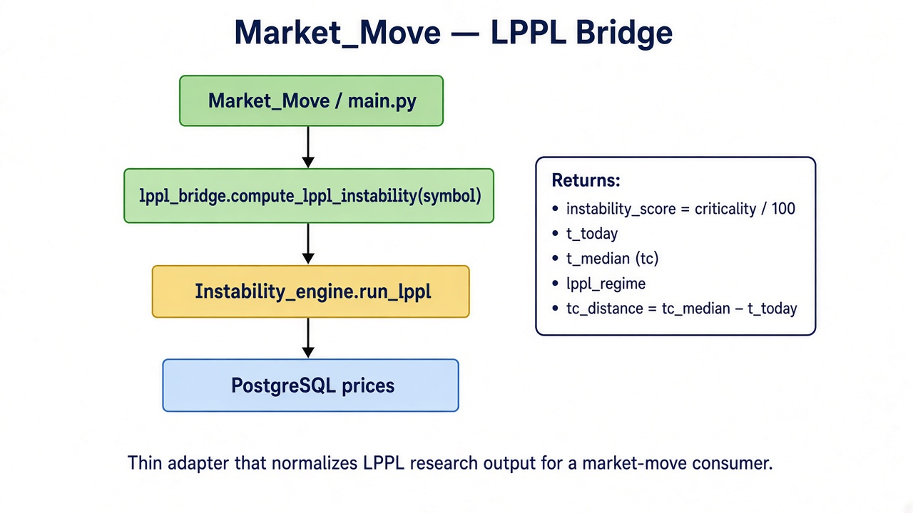
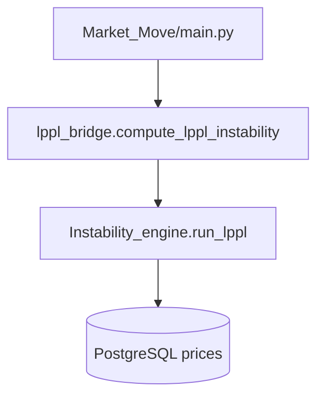

# Market_Move

Thin Python adapter over `Instability_engine`. It does not fit LPPL itself. It calls `run_lppl(symbol)` and reshapes the research signal into a market-move payload.

Use this when another service wants a 0–1 instability score and distance-to-singularity, not the full engine dict.

---

## Architecture





`python/lppl_bridge.py` adds `Project/` to `sys.path`, imports `run_lppl`, and maps:

| Bridge field | Source |
|---|---|
| `instability_score` | `criticality / 100.0` |
| `t_today` | engine `t_today` |
| `t_median` | engine `tc_median` |
| `lppl_regime` | engine `regime` (`NORMAL` / `WARNING` / `CRITICAL`) |
| `tc_distance` | `tc_median - t_today` |

---

## Layout

```
Market_Move/
├── main.py                 # demo: SI=F
├── python/lppl_bridge.py
└── docs/architecture.png
```

---

## How it connects

```
Quant_pipeline → PostgreSQL → Instability_engine.run_lppl → Market_Move
```

- **Upstream:** same `prices` rows the pipeline wrote. If the symbol has fewer than 120 rows, `run_lppl` raises.
- **Sibling consumers:** Streamlit and `run_analysis.py` call the engine directly. This package is the normalized API, not the UI.
- **Downstream:** `main.py` only prints the dict. Drop `compute_lppl_instability` into any other Python caller.

---

## Run

From `Project/` so the engine package resolves:

```bash
python3 -c "from Market_Move.python.lppl_bridge import compute_lppl_instability; print(compute_lppl_instability('SI=F'))"
```

Or:

```bash
cd Project/Market_Move
python3 main.py
```

Example shape:

```python
{
    "instability_score": 0.5853,
    "t_today": 412,
    "t_median": 425.0,
    "lppl_regime": "WARNING",
    "tc_distance": 13.0,
}
```

Regime thresholds are defined in the engine (`CRITICAL` ≥ 70, `WARNING` ≥ 40, else `NORMAL`). See [Instability_engine/readme.md](../Instability_engine/readme.md) for the model.
