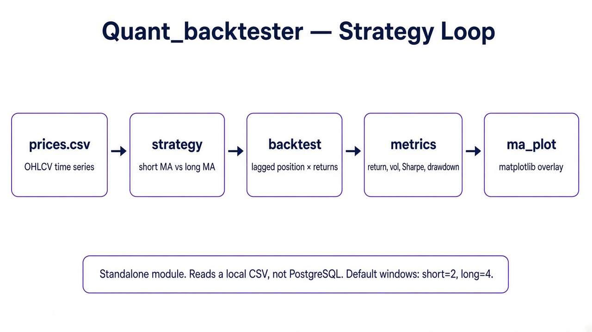
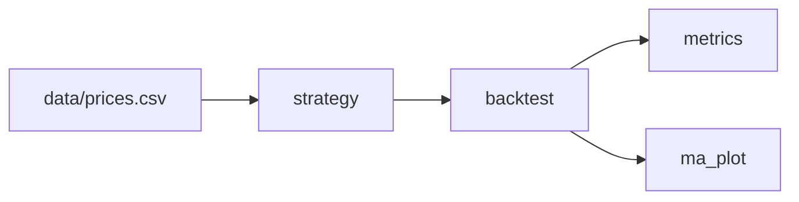

# Quant_backtester

Vectorized moving-average crossover backtester. It is **standalone today**: it reads a local CSV, not the shared PostgreSQL `prices` table.

Use it to evaluate a long/short MA signal, print risk metrics, and plot price vs. both averages.

---

## Architecture





### Stages

1. **Load** — `main.py` reads `data/prices.csv`, parses `date`, sorts, and sets it as the index.
2. **Signal** — `statergy/moving_average.py` builds short and long SMAs on `close`.
   - short MA > long MA → `+1` (long)
   - short MA < long MA → `-1` (short)
   - default windows: `short_window=2`, `long_window=4`
3. **Backtest** — `engine/backtester.py` lags the signal by one bar (`position = signal.shift(1)`) to avoid look-ahead, then:
   - `price_return = close.pct_change()`
   - `strategy_return = position * price_return`
4. **Metrics** — cumulative return, total return, volatility, Sharpe (mean / vol, not annualized), max drawdown.
5. **Plot** — `visualization/ma_plot.py` overlays close, short MA, and long MA.

---

## Layout

```
Quant_backtester/
├── main.py
├── data/prices.csv
├── statergy/moving_average.py    # package name is spelled this way
├── engine/backtester.py
├── visualization/ma_plot.py
└── docs/architecture.png
```

---

## How it connects

| Direction | Status |
|---|---|
| Reads `Quant_pipeline` / PostgreSQL | Not wired. Path is a local CSV. |
| Uses `Instability_engine` regimes | Not wired. A regime-aware backtest already exists on the engine side (`validation/backtest_regimes.py`). |
| Called by Streamlit | No. Run from this folder. |

Natural next wiring: point `main.py` at `read_from_postgres(symbol)` or export `prices` from the pipeline into `data/prices.csv`.

---

## Run

```bash
cd Project/Quant_backtester
python3 main.py
```

Printed metrics:

- Total Return
- Volatility
- Sharpe Ratio
- Max Drawdown

Then a matplotlib window with the MA overlay.

> `main.py` currently has a hardcoded Windows path. Change it to the local `data/prices.csv` (or a Postgres reader) before running on Linux.

---

## CSV contract

The loader expects a `date` column and a `close` column. Other OHLCV fields are unused by the strategy.
