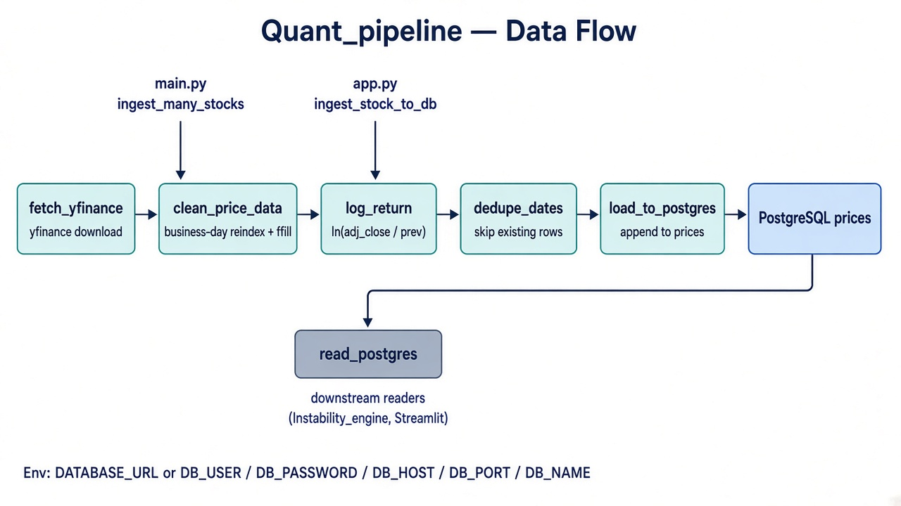
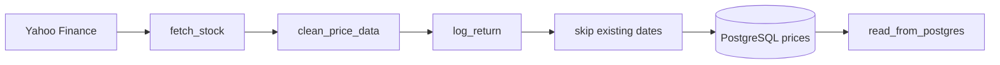

# Quant_pipeline

Ingests Yahoo Finance OHLCV, cleans the calendar, computes log returns, and appends only new rows to PostgreSQL.

This is the **only writer** of the shared `prices` table. `Instability_engine`, Streamlit, and `Market_Move` all depend on data that landed here.

---

## Architecture





### Stages

1. **Fetch** — `ingestion/fetch_yfinance.py` downloads the symbol with `yfinance`, flattens MultiIndex columns, lowercases names, and stamps `symbol`.
2. **Clean** — `cleaning/clean_data.py` sorts by date, reindexes onto a business-day calendar (`freq="B"`), forward-fills OHLC / `adj_close` / `symbol`, and sets volume to `0` on non-trading days.
3. **Feature** — `log_return = ln(adj_close / adj_close.shift(1))`, first row filled with `0`.
4. **Dedupe** — dates already stored for that symbol are dropped. If the table does not exist yet, every row is inserted.
5. **Load** — `storage/postgres_loader.py` appends to `prices` via SQLAlchemy (`if_exists="append"`, `method="multi"`).
6. **Read** — `storage/read_postgres.py` is the generic downstream reader (`date`, `adj_close`, `close`, `open`).

A final NaN assertion runs before insert.

---

## Layout

```
Quant_pipeline/
├── main.py                      # batch CLI: ingest_many_stocks
├── ingestion/fetch_yfinance.py
├── cleaning/clean_data.py
├── storage/
│   ├── pipeline.py              # ingest_stock_to_db / ingest_many_stocks
│   ├── postgres_loader.py       # engine + load_to_postgres
│   └── read_postgres.py
└── docs/architecture.png
```

---

## How it connects

| Caller | Function | Purpose |
|---|---|---|
| `Quant_pipeline/main.py` | `ingest_many_stocks` | Batch CLI (default `SI=F`, `2024-01-01` → `2025-12-15`) |
| `Project/app.py` (Data Ingestion tab) | `ingest_stock_to_db` | Interactive ingest with start/end dates |
| `Instability_engine` | reads `prices` via its own `db_data.py` | LPPL input |
| `storage/read_postgres.py` | `read_from_postgres` | Shared reader for other consumers |

Connection config (loaded with `python-dotenv`):

- `DATABASE_URL` (Render / hosted), or
- `DB_USER`, `DB_PASSWORD`, `DB_HOST`, `DB_PORT`, `DB_NAME`

`postgres://` URLs are rewritten to `postgresql://`.

---

## Run

From `Project/Quant_pipeline` (so `ingestion` / `storage` / `cleaning` import as top-level packages):

```bash
python3 main.py
```

Or from the Streamlit **Data Ingestion** tab.

Expected success message:

```
SI=F ingested successfully (N new rows)
```

or

```
SI=F — no new data to insert (already up to date)
```

---

## `prices` schema written by this pipeline

`date`, `open`, `high`, `low`, `close`, `adj_close`, `volume`, `symbol`, `log_return`.

Downstream LPPL needs `date`, `adj_close`, `log_return`, and at least 120 rows per symbol.
