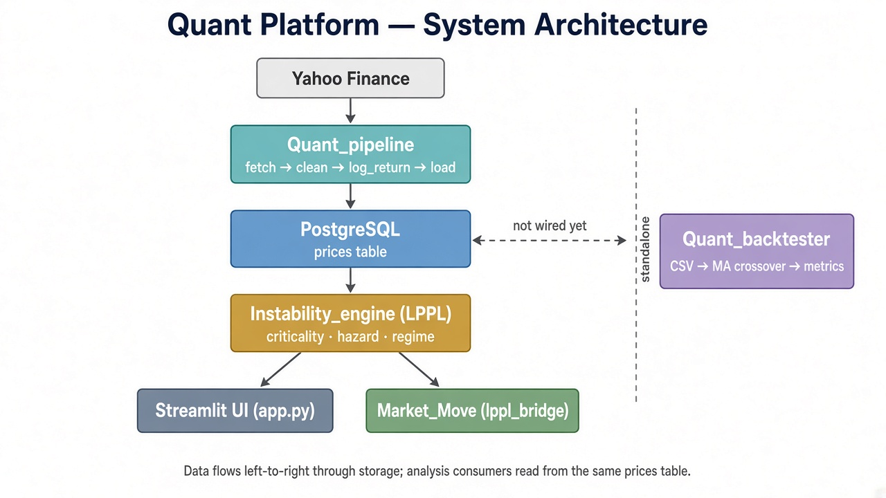
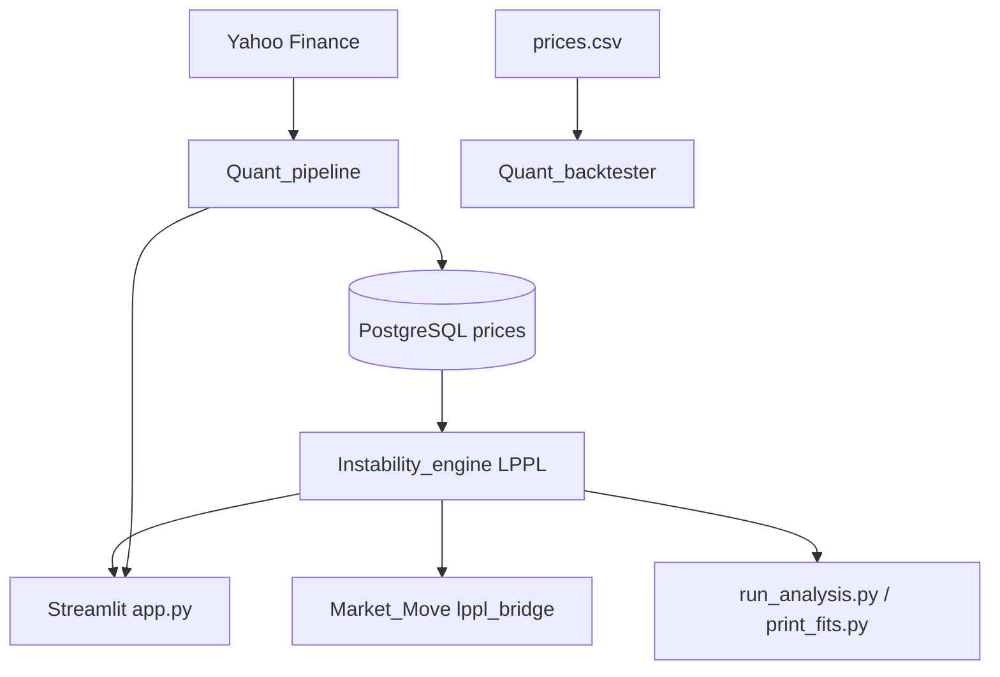

# Quant Platform

Research stack for ingesting market data, detecting speculative instability with LPPL, and backtesting simple price strategies.

The platform is a set of connected Python projects under `Project/`. They share one PostgreSQL `prices` table. The Streamlit app is the UI that wires ingestion and analysis together.

---

## How the projects connect





| Project | Role | Reads from | Writes to |
|---|---|---|---|
| [Quant_pipeline](Quant_pipeline/README.md) | Fetch, clean, and store OHLCV | Yahoo Finance | PostgreSQL `prices` |
| [Instability_engine](Instability_engine/readme.md) | LPPL bubble / crash-regime detection | PostgreSQL `prices` | In-memory signal (`criticality`, `hazard`, `regime`) |
| [Market_Move](Market_Move/README.md) | Thin adapter over the LPPL engine | `Instability_engine.run_lppl` | Normalized `instability_score` |
| [Quant_backtester](Quant_backtester/README.md) | Moving-average strategy backtest | Local `prices.csv` | Metrics + matplotlib plot |
| Streamlit `app.py` | Operator UI | Pipeline + engine | Same DB / same LPPL output |

**Data path (connected):** Yahoo Finance → `Quant_pipeline` → PostgreSQL → `Instability_engine` → Streamlit / `Market_Move` / CLI.

**Standalone path:** `Quant_backtester` still reads a local CSV. It is not wired to Postgres yet.

The LPPL research write-up lives in [`Instability_engine/readme.md`](Instability_engine/readme.md) and is left as-is.

---

## Repository layout

```
Project/
├── app.py                    # Streamlit UI: ingest + LPPL analysis
├── run_analysis.py           # CLI: run LPPL, write result.json
├── print_fits.py             # CLI: dump raw LPPL fit parameters
├── docker-compose.yml        # Local PostgreSQL 15
├── render.yaml               # Render.com web + managed DB
├── requirements.txt
├── Quant_pipeline/           # Ingestion → clean → Postgres
├── Instability_engine/       # LPPL model, scores, regime
├── Market_Move/              # Bridge API over the engine
└── Quant_backtester/         # MA crossover backtest (CSV)
```

---

## Quick start

### 1. Database

```bash
cd Project
docker compose up -d
```

This starts `quant_postgres` on port `5432` with:

- user: `quant_user`
- password: `quant_password`
- database: `quant_db`

Create a `Project/.env` (never commit it):

```env
DB_USER=quant_user
DB_PASSWORD=quant_password
DB_HOST=localhost
DB_PORT=5432
DB_NAME=quant_db
```

`DATABASE_URL` is also accepted (used on Render). `postgres://` is rewritten to `postgresql://`.

### 2. Install

```bash
cd Project
python3 -m venv .venv
source .venv/bin/activate
pip install -r requirements.txt
```

### 3. Ingest prices

```bash
cd Project/Quant_pipeline
python3 main.py
```

Or use the **Data Ingestion** tab in Streamlit.

### 4. Run LPPL analysis

```bash
cd Project
python3 run_analysis.py
```

Or use the **Instability Analysis** tab in Streamlit.

### 5. Open the UI

```bash
cd Project
streamlit run app.py
```

---

## Runtime surfaces

| Entry point | What it does |
|---|---|
| `streamlit run app.py` | Tab 1 calls `ingest_stock_to_db`. Tab 2 calls `run_lppl`. |
| `python3 Quant_pipeline/main.py` | Batch ingest (default `SI=F`). |
| `python3 Instability_engine/main.py` | LPPL for `SI=F`, prints the final signal. |
| `python3 Market_Move/main.py` | Same engine, returns a normalized score dict. |
| `python3 Quant_backtester/main.py` | MA backtest on `data/prices.csv`. |
| `python3 run_analysis.py` | Batch LPPL → `result.json`. |
| `python3 print_fits.py` | Prints every accepted rolling-window fit. |

---

## Shared contract: `prices`

All connected projects assume this table:

| Column | Used by |
|---|---|
| `date` | Pipeline, engine, readers |
| `symbol` | Dedup and queries |
| `open`, `high`, `low`, `close`, `adj_close`, `volume` | Pipeline write |
| `log_return` | Pipeline write; engine read |

`Instability_engine` derives `t` (ordinal time) and `log_price = ln(adj_close)` at read time. At least **120** rows are required before an LPPL run.

---

## Deploy

`render.yaml` defines:

- a managed Postgres instance (`quant-db`)
- a Python web service that runs `streamlit run app.py --server.port $PORT`
- `DATABASE_URL` injected from the managed database

---

## Disclaimer

Research and education only. Not financial advice. LPPL flags probabilistic instability, not a guaranteed crash. The moving-average backtester is a toy strategy on a local CSV.
